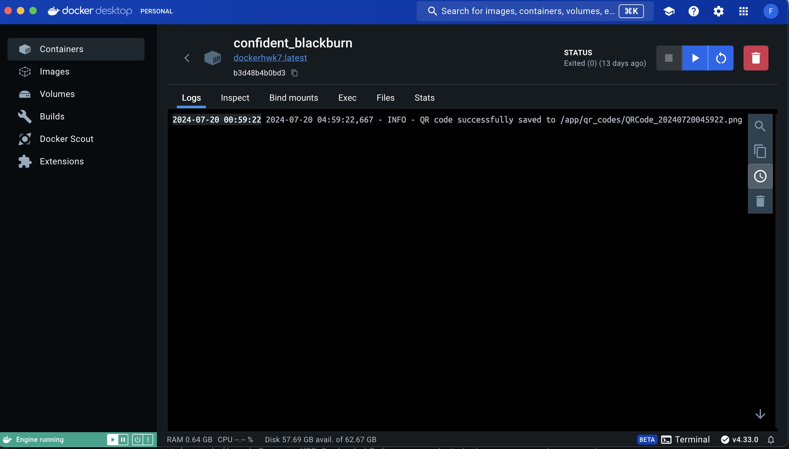

# Docker & Python

## Purpose 
This assignment aims to leverage __Docker__ and __Python__ to develop a program capable of generating a QR code in PNG format. This QR code will encode a URL that directs users to a specific website. 
> By scanning the QR code with a smartphone camera, users can easily access and be redirected to the designated web page. For this project, the encoded URL will lead to my GitHub homepage: [*https://github.com/fcamacho3*](https://github.com/fcamacho3).

## GitHub homepage QR

## Viewing Logs
> VS Code

> 

> Docker

